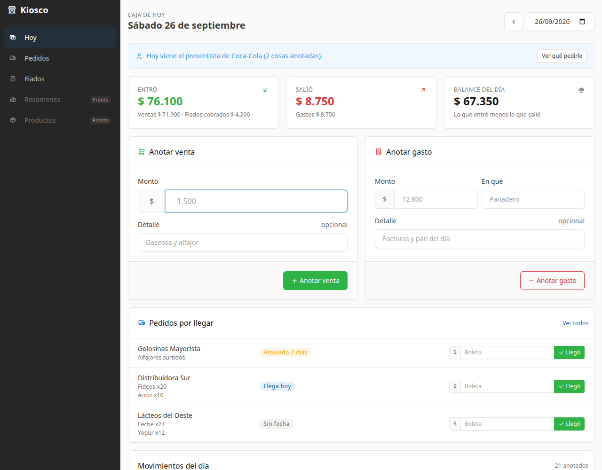
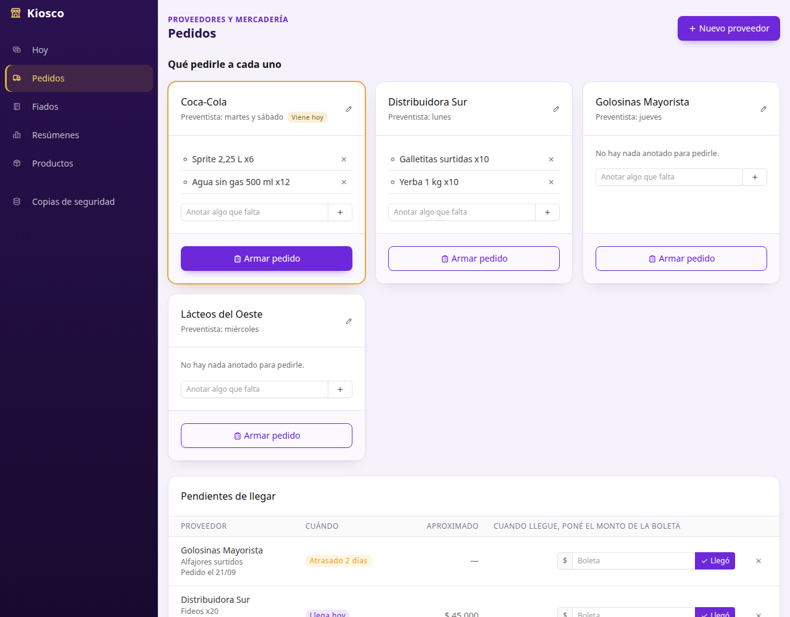
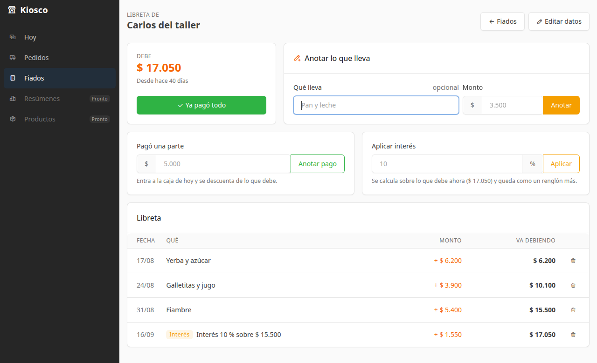

# Kiosco

Control diario de la caja de un kiosco de barrio: lo que se vende, lo que se gasta, lo que se les paga a los proveedores y lo que se fía, con cierre de caja automático al terminar cada día.

Es una app web que corre en la propia PC (**Spring Boot 4 + Thymeleaf + HTMX**) y se abre en una ventana propia, así que se usa como una app de escritorio. No necesita internet.



## Qué hace

### Caja del día

- **Anotar una venta en segundos**: se escribe el monto y se aprieta Enter. Acepta `1500`, `1.500` o `1.500,50`.
- **Anotar gastos** por categoría (panadero, verdulería, servicios…). Sugiere las categorías que ya se usaron.
- **Totales del día**: cuánto entró, cuánto salió y el balance, actualizados al instante.
- **Cierre de caja automático** a la medianoche. Si la PC estuvo apagada, los días pendientes se cierran al abrir la app.
- **Días anteriores**: se pueden revisar y corregir (por ejemplo, un gasto que no se anotó), y el cierre de ese día se recalcula solo.

### Pedidos a proveedores



- **Notas por proveedor**: durante la semana se anota lo que falta pedirle a cada uno.
- **Días del preventista**: el día que viene, la pantalla principal lo avisa junto con lo que hay anotado para pedirle.
- **Armar el pedido**: las notas pasan al pedido. La fecha de llegada y el monto son opcionales, porque muchas veces no se saben.
- **"Llegó" con el monto de la boleta**: se marca desde la caja del día o desde Pedidos, y la boleta queda sola como salida de plata. Los pedidos atrasados se marcan en amarillo.
- **Deshacer**: si se marcó por error, el pedido vuelve a pendiente y el pago se borra de la caja.

### Fiados



- **Anotar en segundos**: quién, qué lleva y cuánto. Si es la primera vez que lleva fiado, el cliente se agrega solo.
- **Libreta con suma constante**: cada renglón muestra cuánto "va debiendo", como la cuenta al margen de una libreta de papel.
- **"Ya pagó"**: con un botón, la plata entra a la caja del día y la cuenta queda en cero. Los renglones pagados pasan al historial y no se pierden.
- **Pagos a cuenta**: si deja una parte, se anota, entra a la caja y se descuenta de lo que debe.
- **Interés a pedido**: se aplica un % sobre lo que debe en ese momento y queda como un renglón más, a la vista.
- **Cuánto te deben en total** y desde hace cuánto debe cada uno. Ese total no aparece en la pantalla principal.
- **Correcciones**: se puede borrar un renglón anotado mal o deshacer un "ya pagó", y la caja se ajusta sola.

### Hoja de ruta

- [x] Caja del día: ventas, gastos, balance y cierre automático
- [x] Pedidos a proveedores: notas de qué pedirle a cada uno, días del preventista y "llegó" con el monto de la boleta
- [x] Fiados: libreta por cliente con saldo acumulado, pagos, interés a pedido e historial
- [ ] Resúmenes: últimos 7 días y mes por mes, con gráficos
- [ ] Productos con stock opcional, backup automático e ícono de escritorio

## Stack

| Capa | Tecnología |
|---|---|
| Backend | Java 21, Spring Boot 4.1 (Web MVC, Data JPA, Validation, Security) |
| Persistencia | Hibernate 7, MySQL 8, migraciones con Flyway |
| Interfaz | Thymeleaf, HTMX 2, plantilla [Tabler](https://tabler.io) (Bootstrap 5), empaquetadas como WebJars |
| Tests | JUnit 5, AssertJ, MockMvc, Spring Security Test, H2 en modo MySQL |

## Decisiones de diseño

- **Un solo libro de caja.** Cada peso que entra o sale es un renglón de `movimiento_caja` con un tipo: venta, gasto, pago de pedido o cobro de fiado. Todos los totales, cierres y resúmenes salen de sumar esa tabla, así que los números de las distintas pantallas siempre coinciden.
- **La plata es `BigDecimal` / `DECIMAL(12,2)`**, nunca `double`, para no perder centavos por redondeo.
- **El cierre diario es una foto guardada** (`cierre_diario`). El historial mensual queda armado de antemano y no hay que recalcular meses enteros cada vez.
- **El reloj se inyecta** (`java.time.Clock`). Así los tests pueden simular que pasan los días, por ejemplo la PC apagada tres días, sin esperar a la medianoche.
- **Seguridad pensada para uso local.** El servidor solo escucha en `127.0.0.1`. La protección CSRF evita que otra página abierta en el navegador cargue o borre movimientos. El token va en una cookie para que la pantalla, que queda abierta todo el día, siga funcionando aunque la app se reinicie.
- **Módulos que no se pisan.** `caja` no conoce a `pedidos` ni a `fiados`: esos módulos anotan la plata a través del servicio de caja, y la pantalla `hoy` es la única que junta todo. El pago de una boleta y el cobro de un fiado solo se corrigen desde su módulo, para que la caja y el pedido o la libreta nunca queden desparejos.
- **Fiar no es vender.** Lo que se lleva fiado no toca la caja, porque no entró plata. Recién cuando el cliente paga se registra un "cobro de fiado" en la caja del día. Así el balance diario refleja la plata real.
- **Todo se renderiza en el servidor, con HTMX.** Los formularios actualizan solo el panel del día, sin recargar la página y sin mantener una SPA aparte. Los formularios de carga funcionan igual sin JavaScript.

## Probarla sin instalar MySQL (modo demo)

El modo demo arranca con una base en memoria y datos inventados: dos meses de ventas y gastos, proveedores con pedidos y clientes con fiado.

```bash
mvn clean package
./kiosco.sh demo
```

`kiosco.sh` levanta la app y la abre en una ventana de Chrome sin barra de direcciones. También se puede correr a mano con `java -jar target/kiosco.jar --spring.profiles.active=demo` y abrir http://localhost:8080.

## Usarla con MySQL

1. En MySQL Workbench, abrí [`scripts/crear-base-mysql.sql`](scripts/crear-base-mysql.sql), cambiá la contraseña y ejecutalo. Esto crea la base `kiosco` y su usuario.
2. Copiá [`scripts/kiosco.properties.ejemplo`](scripts/kiosco.properties.ejemplo) a `~/.kiosco/kiosco.properties` y poné esa misma contraseña. Ese archivo queda fuera del repositorio.
3. Compilá y abrí la app:

   ```bash
   mvn clean package
   ./kiosco.sh
   ```

Las tablas se crean solas la primera vez gracias a Flyway. En lugar del archivo también se pueden usar las variables de entorno `DB_URL`, `DB_USER` y `DB_PASSWORD`.

## Tests

```bash
mvn test
```

Cubren cinco cosas:

- La lectura de montos escritos a la argentina.
- El cierre automático: días con la PC apagada, correcciones de días ya cerrados, días salteados y fechas futuras.
- Las reglas de pedidos: notas que pasan al pedido, boleta que sale de la caja, deshacer y cancelar, y qué pedidos mostrar en la caja de hoy.
- Las reglas de fiados: saldo acumulado, pagos parciales y totales, interés redondeado, historial, correcciones y que nunca se pueda pagar más de lo que se debe.
- Las pantallas con MockMvc: carga con HTMX, errores de validación, redirección sin JavaScript y rechazo de pedidos sin token CSRF.

Los tests de pantallas no corren dentro de una transacción, igual que la app real, donde cada pedido HTTP tiene la suya. Así aparecen los errores de carga diferida de Hibernate que un test transaccional escondería. Las migraciones también se probaron contra un MySQL 8 real, incluidas las actualizaciones de una versión de la base a la siguiente.

## Estructura

```
src/main/java/org/kiosco/
├── caja/      libro de caja: movimientos y totales
├── cierre/    cierre diario automático
├── hoy/       pantalla principal: junta caja, pedidos y avisos del día
├── pedidos/   proveedores, notas de qué pedir y pedidos
├── fiados/    clientes y su libreta
├── comun/     montos, fechas y manejo de errores
├── config/    seguridad y reloj
└── demo/      datos de ejemplo del modo demo
src/main/resources/
├── db/migration/   migraciones de Flyway
├── templates/      vistas Thymeleaf (layout + pantallas)
└── static/         estilos y JavaScript propios
```

## Versión anterior

La primera versión (tag [`v1-swing`](../../tree/v1-swing)) era una app de escritorio con Swing, JPA y PostgreSQL centrada en el stock. La v2 cambió el foco al control de la plata del día a día, que es lo que más hace falta cuando no hay tiempo para estar encima del negocio.
